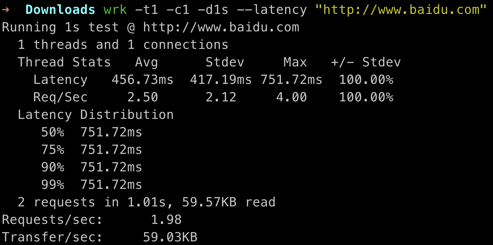
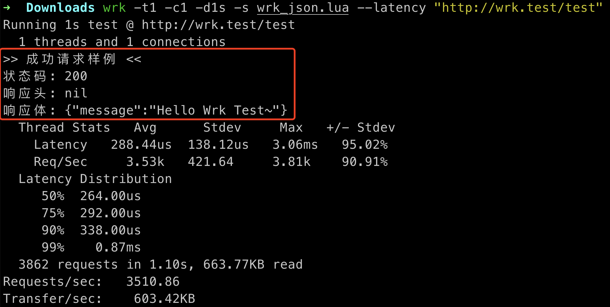

# Wrk 压测工具入门

官方简介：
`WRK 是一个现代化的 HTTP 基准测试工具，能够在单个多核 CPU 上生成显著的负载。它结合了多线程设计和可扩展的事件通知系统，例如 epoll 和 kqueue。
此外，WRK 支持可选的 LuaJIT 脚本，用于执行 HTTP 请求生成、响应处理以及自定义报告。详细信息可以参考 SCRIPTING 文件，多个示例脚本位于 scripts/ 目录中。`


## 1. mac homebrew 安装 wrk
``` shell
# 安装 wrk
brew install wrk

# 检查 wrk 是否安装成功
wrk --version
# 输出：wrk 4.x.x 即可
```


## 2. wrk快速上手体验
#### 2.1 Get请求压测体验
执行 `wrk -t1 -c1 -d1s --latency "http://www.baidu.com"`
得到结果:


#### 2.2 Post请求压测体验
##### 2.2.1 编写lua脚本，定义 RequestBody 和 ResponseBody
编写lua脚本文件，保存为`wrk_json.lua`
``` lua
wrk.method = "POST"
wrk.headers["Content-Type"] = "application/json"
wrk.body = '{"test_field":"hello_world"}'  -- 固定测试参数

-- 请求构造
request = function()
    return wrk.format()  -- 直接使用全局配置
end

printed_200 = false
-- 基础响应验证 (可自行打开看看，默认关闭)
response = function(status, _, body)
    if status == 200 and not printed_200 then
        print(">> 成功请求样例 <<")
        print("状态码:", status)
        print("响应头:", headers)
        print("响应体:", body)  -- 截断显示前200字符
        printed_200 = true  -- 标记已打印
    end
end
```
##### 2.2.2 Nginx 服务配置
在本地的Nginx服务上配置直接返回json数据的location（大家可以根据自己的服务自己定义）
``` nginx
server {
    listen       80  default;
    server_name  wrk.test;
    
    location = /test {
        default_type application/json;
        return 200 '{"message":"Hello Wrk Test~"}';
    }
```

##### 2.2.3 执行压测
执行 `wrk -t1 -c1 -d1s -s wrk_json.lua --latency "http://wrk.test/test"`
得到结果:


可以看到接口返回的数据，说明lua脚本生效了。

## 3. Wrk 命令参数与响应介绍
### 3.1 命令参数介绍
| 参数名称               | 作用描述                                                                 | 示例值             | 说明                                                                 |
|------------------------|--------------------------------------------------------------------------|--------------------|----------------------------------------------------------------------|
| `-c, --connections <N>` | 设置与服务器保持的TCP连接总数（并发数） | `-c1000`| 建议从100开始逐步增加，过高可能导致系统资源耗尽|
| `-d, --duration <T>`| 指定压测持续时间| `-d30s`| 支持单位：s（秒）、m（分钟）、h（小时），稳定性测试建议3分钟以上|
| `-t, --threads <N>`| 设置压测线程数 | `-t12`| 建议为CPU核心数的2-4倍，线程过多会降低效率|
| `-s, --script <S>` | 加载Lua脚本实现复杂请求  | `-s post_json.lua` | 支持动态参数生成、鉴权请求、响应解析等高级功能|
| `-H, --header <H>` | 添加HTTP请求头（可重复使用）| `-H "Content-Type: application/json"` | 用于设置鉴权、版本控制等请求头 |
| `--latency`| 输出详细的延迟分布统计| 必选参数           | 显示P50/P90/P99等分位值，评估服务稳定性            |
| `--timeout <T>` | 设置请求超时时间      | `--timeout 10s`    | 默认无限制，建议根据业务场景设置合理值    |
| `-v, --version`| 显示版本信息     | `wrk -v`      | 输出示例：`wrk 4.2.0 [epoll]`           |

### 3.2 响应参数介绍
`2.1 Get请求压测体验` 得到的命令及响应说明：
``` shell 
# 用1个线程、1个并发连接，对 http://www.baidu.com 进行1秒钟的压测，并输出延迟统计。​
wrk -t1 -c1 -d1s --latency "http://www.baidu.com"

# 响应说明：
## 测试时长​​：1秒（1s test）​​；目标URL​​：http://www.baidu.com 
Running 1s test @ http://www.baidu.com
##  ​​压力规模​​：1个线程模拟1个并发连接
  1 threads and 1 connections
## 线程统计（Thread Stats）​
  Thread Stats   Avg      Stdev     Max   +/- Stdev
    Latency    57.85ms   10.62ms  81.38ms   62.50%
    Req/Sec    15.80      5.01    20.00     60.00%
## 延迟分布（Latency Distribution）​
  Latency Distribution
     50%   57.29ms
     75%   64.30ms
     90%   71.52ms
     99%   81.38ms
## 全局统计​
  16 requests in 1.01s, 477.86KB read
Requests/sec:     15.90
Transfer/sec:    474.74KB
```
`线程统计（Thread Stats）​`
| 指标         | 子项       | 含义 | 值       | 说明                                |
|--------------|------------|-----------|----------|-----------------------------------|
| **Latency**（延迟） | Avg        |平均延迟| 57.85ms | 平均响应时间                      |
|              | Stdev      |标准差| 10.62ms | 延迟波动范围（越小越稳定）        |
|              | Max        |最大延迟| 81.38ms | 最慢请求耗时                      |
|              | +/- Stdev  |数据分布比例| 62.50%  | 62.5%数据在均值±标准差范围内      |
| **Req/Sec**（吞吐量）  | Avg        |平均QPS| 15.80   | 平均每秒请求数（QPS）             |
|              | Stdev      |QPS波动| 5.01    | QPS波动幅度                       |
|              | Max        |峰值QPS| 20.00   | 瞬时最高QPS                       |
|              | +/- Stdev  |数据分布比例| 60.00%  | 60%数据在均值±标准差范围内        |

`延迟分布（Latency Distribution）​`
| 分位点 | 延迟值    | 统计学意义                     |
|--------|-----------|------------------------------|
| 50%    | 57.29ms   | 中位延迟，半数请求快于此值    |
| 75%    | 64.30ms   | 75%的请求快于此值            |
| 90%    | 71.52ms   | 90%的请求快于此值            |
| 99%    | 81.38ms   | 极端高延迟请求（长尾效应）    |

`全局统计​`
| 指标               | 值          | 计算公式/说明                  |
|--------------------|-------------|-------------------------------|
| 总请求量           | 16次        | 实际完成的请求总数            |
| 总数据量           | 477.86KB    | 所有响应数据累计大小          |
| **Requests/sec**   | 15.90 QPS   | 总请求量/测试时间（16/1.01s） |
| **Transfer/sec**   | 474.74KB/s  | 总数据量/测试时间             |